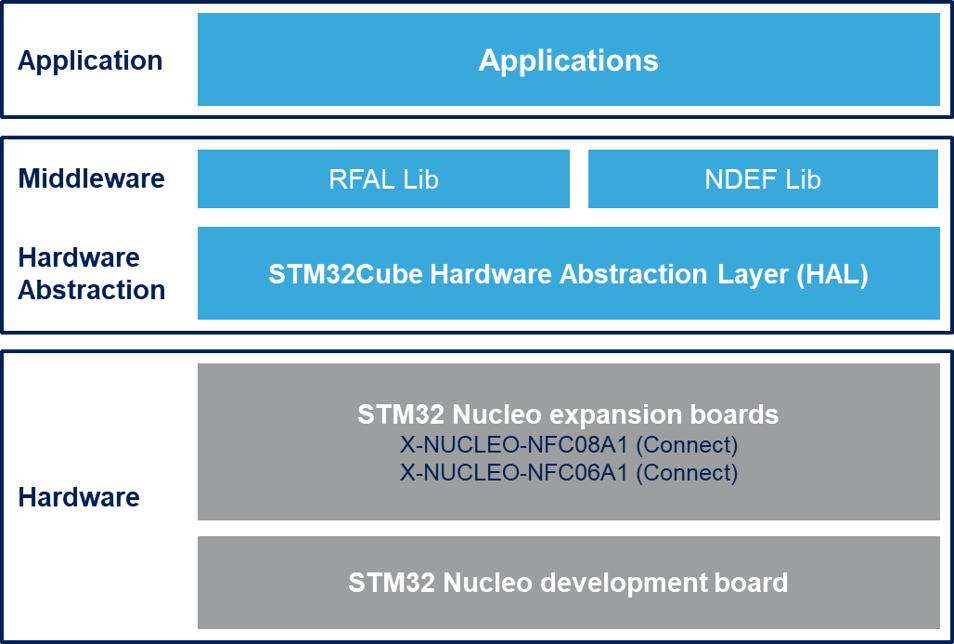

::: {.row}
::: {.col-sm-12 .col-lg-4}
[Release Notes for]{.small} **X-CUBE-NFC6 Software for STM32**
==============================================================

Copyright © 2022 STMicroelectronics\

{.logo}

Purpose
=======

The **X-CUBE-NFC6** software package is an expansion for STM32Cube. This
software provides drivers running on STM32 for ST25R3916 and ST25R3916B
device. It is built on top of STM32Cube software technology that ease
portability across different STM32 micro-controllers. This Expansion
Firmware is built over the X-NUCLEO-NFC06A1 and X-NUCLEO-NFC08A1
Expansion Board. This Expansion Board can be plugged on the Arduino UNO
R3 connectors of any STM32 Nucleo board. The user can mount the ST
Morpho connectors if required. The Expansion Board can be easily stacked
in order to evaluate different devices with NFC communication.

The expansion is built on STM32Cube software technology to ease
portability across different STM32 microcontrollers.

X-CUBE-NFC6 software features:
==============================

-   Complete middleware to build applications using the
    ST25R3916/ST25R3916B high performance HF reader / NFC front end IC

-   Easy portability across different MCU families, thanks to STM32Cube

-   Free, user-friendly license terms

Examples implementation available on board X-NUCLEO-NFC06A1 and
X-NUCLEO-NFC08A1 plugged on top of one NUCLEO board

-   NUCLEO-G0B1RE nucleo development board
-   NUCLEO-L476RG nucleo development board

The figure below shows the firmware architecture:

Here is the list of references to user documents:

-   [Getting
    Started](https://www.st.com/resource/en/user_manual/um2961-getting-started-with-the-xcubenfc7-dynamic-nfcrfid-tag-ic-software-expansion-for-stm32cube-stmicroelectronics.pdf)
    : Getting started with the X-CUBE-NFC6 dynamic NFC/RFID tag IC
    software expansion for STM32Cube
-   [STM32Cube](http://www.st.com/stm32cube) : STM32Cube
-   [STM32 Nucleo boards](http://www.st.com/stm32nucleo) : STM32 Nucleo
    boards
:::

::: {.col-sm-12 .col-lg-8}
Update History
==============

::: {.collapse}
V3.1.0 / 18-Jan-2024

Main Changes
------------

### Product Update {#maintenance-release}

-   Update has been done related to NDEF Application example
-   NUCLEO-G0B1RE board is supported in place of NUCLEO-L053R8

Contents
--------

The components flagged by "[]{.icon-st-update}" have changed since the
previous release. "[]{.icon-st-add}" are new.

  Name                                                                    Version                    Document
  ----------------------------------------------------------------------- -------------------------- ------------------------------------------------------------------------
  Getting started with the X-CUBE-NFC6 software expansion for STM32Cube   3.1.0[]{.icon-st-update}   [CHM](Documentation\X-CUBE-NFC6.chm)
  X-CUBE-NFC6 API Description                                             3.1.0[]{.icon-st-update}   [PDF](Documentation\STMicroelectronics.X-CUBE-NFC6_GettingStarted.pdf)

  : Documentation\

  Name                                                         Version                    Document
  ------------------------------------------------------------ -------------------------- -----------------------------------------------------------------------------------------
  NUCLEO-G0B1RE\\Applications\\NFC06A1\_PollingTagDetect       3.1.0[]{.icon-st-update}   [Read Me](Projects\NUCLEO-G0B1RE\Applications\NFC06A1_PollingTagDetect\readme.html)
  NUCLEO-G0B1RE\\Applications\\NFC06A1\_PollingTagDetectNDEF   3.1.0[]{.icon-st-update}   [Read Me](Projects\NUCLEO-G0B1RE\Applications\NFC06A1_PollingTagDetectNDEF\readme.html)
  NUCLEO-G0B1RE\\Applications\\NFC08A1\_PollingTagDetect       3.1.0[]{.icon-st-update}   [Read Me](Projects\NUCLEO-G0B1RE\Applications\NFC08A1_PollingTagDetect\readme.html)
  NUCLEO-G0B1RE\\Applications\\NFC08A1\_PollingTagDetectNDEF   3.1.0[]{.icon-st-update}   [Read Me](Projects\NUCLEO-G0B1RE\Applications\NFC08A1_PollingTagDetectNDEF\readme.html)
  NUCLEO-L476RG\\Applications\\NFC06A1\_PollingTagDetect       3.1.0[]{.icon-st-update}   [Read Me](Projects\NUCLEO-L476RG\Applications\NFC06A1_PollingTagDetect\readme.html)
  NUCLEO-L476RG\\Applications\\NFC06A1\_PollingTagDetectNDEF   3.1.0[]{.icon-st-update}   [Read Me](Projects\NUCLEO-L476RG\Applications\NFC06A1_PollingTagDetectNDEF\readme.html)
  NUCLEO-L476RG\\Applications\\NFC08A1\_PollingTagDetect       3.1.0[]{.icon-st-update}   [Read Me](Projects\NUCLEO-L476RG\Applications\NFC08A1_PollingTagDetect\readme.html)
  NUCLEO-L476RG\\Applications\\NFC08A1\_PollingTagDetectNDEF   3.1.0[]{.icon-st-update}   [Read Me](Projects\NUCLEO-L476RG\Applications\NFC08A1_PollingTagDetectNDEF\readme.html)

  : Projects\

  Name                         Version                                     Document
  ------------------ --------------------------- ------------------------------------------------------------
  NDEF Middlewares    1.4.0 []{.icon-st-update}     [Release Note](Middlewares\ST\ndef\Doc\changelog.txt)
  RFAL Middlewares    2.8.0 []{.icon-st-update}   [Release Note](Middlewares\ST\rfal\Doc\Release_Notes.html)

  : Middlewares\

Drivers\

Name

:::
:::
:::

Version

Document

BSP NFC06A1

V1.0.0 []{.icon-st-update}

[release notes](Drivers\BSP\NFC06A1\Release_Notes.html)

BSP NFC08A1

V1.0.0 []{.icon-st-update}

[release notes](Drivers\BSP\NFC08A1\Release_Notes.html)

Component Driver ST25R3916

V1.0.6 []{.icon-st-update}

[release notes](Drivers\BSP\Components\ST25R3916\Release_Notes.html)

STM32G0xx CMSIS

V1.4.3 []{.icon-st-update}

[release notes](Drivers\CMSIS\Device\ST\STM32G0xx\Release_Notes.html)

STM32G0xx HAL

V1.4.5 []{.icon-st-update}

[release notes](Drivers\STM32G0xx_HAL_Driver\Release_Notes.html)

BSP STM32G0xx\_Nucleo

V1.1.2 []{.icon-st-update}

[release notes](Drivers\BSP\STM32G0xx_Nucleo\Release_Notes.html)

STM32L4xx CMSIS

V1.7.2 []{.icon-st-update}

[release notes](Drivers\CMSIS\Device\ST\STM32L4xx\Release_Notes.html)

STM32L4xx HAL

V1.13.2 []{.icon-st-update}

[release notes](Drivers\STM32L4xx_HAL_Driver\Release_Notes.html)

BSP STM32L4xx\_NUCLEO

V2.1.7 []{.icon-st-update}

[release notes](Drivers\BSP\STM32L4xx_Nucleo\Release_Notes.html)

  Name        Version                                                     Document
  ----------- ---------------------------- ----------------------------------------------------------------------
  ST25R3916   V1.0.5 []{.icon-st-update}    [release notes](Drivers\BSP\Components\ST25R3916\Release_Notes.html)

  : Components\

Known Limitations
-----------------

-   The Firmware doesn\'t work with secure microcontroller
-   While using I2C Interface, Please set Pin PA5 to Analog Input Mode

Known Issues
------------

-   N/A.

Important Hardware Additional Information
-----------------------------------------

-   N/A.

Development Toolchains and Compilers
------------------------------------

-   IAR Embedded Workbench for ARM (EWARM) toolchain V9.20.1 + STLink/V2
-   RealView Microcontroller Development Kit (MDK-ARM) toolchain
    V5.37.0 + ST-LINK/V2
-   Integrated Development Environment for STM32 (STM32CubeIDE)
    V1.14.0 + ST-LINK

Supported Devices and Boards
----------------------------

-   NUCLEO-G0B1RE: STM32 Nucleo-64 development board with STM32G0B1RE
    MCU, supports Arduino and ST morpho connectivity
    \[[NUCLEO-G0B1RE](https://www.st.com/content/st_com/en/products/evaluation-tools/product-evaluation-tools/mcu-mpu-eval-tools/stm32-mcu-mpu-eval-tools/stm32-nucleo-boards/nucleo-g0b1re.html)\]
-   NUCLEO-L476RG: STM32 Nucleo-64 development board with STM32L476RG
    MCU, supports Arduino and ST morpho connectivity
    \[[NUCLEO-L476RG](https://www.st.com/content/st_com/en/products/evaluation-tools/product-evaluation-tools/mcu-mpu-eval-tools/stm32-mcu-mpu-eval-tools/stm32-nucleo-boards/nucleo-l476rg.html)\]

Backward Compatibility
----------------------

None

Dependencies
------------

None

::: {.collapse}
V3.0.0 / 11-July-2023

Main Changes {#main-changes}
------------

### Product Update {#maintenance-release}

-   Added support to CubeMX

Contents {#contents}
--------

The components flagged by "[]{.icon-st-update}" have changed since the
previous release. "[]{.icon-st-add}" are new.

  Name                                                                    Version                    Document
  ----------------------------------------------------------------------- -------------------------- ------------------------------------------------------------------------
  Getting started with the X-CUBE-NFC6 software expansion for STM32Cube   3.0.0[]{.icon-st-update}   [CHM](Documentation\X-CUBE-NFC6.chm)
  X-CUBE-NFC6 API Description                                             3.0.0[]{.icon-st-update}   [PDF](Documentation\STMicroelectronics.X-CUBE-NFC6_GettingStarted.pdf)

  : Documentation\

  Name                                                         Version                    Document
  ------------------------------------------------------------ -------------------------- -----------------------------------------------------------------------------------------
  NUCLEO-L053R8\\Applications\\NFC06A1\_PollingTagDetect       3.0.0[]{.icon-st-update}   [Read Me](Projects\NUCLEO-L053R8\Applications\NFC06A1_PollingTagDetect\readme.html)
  NUCLEO-L053R8\\Applications\\NFC08A1\_PollingTagDetect       3.0.0[]{.icon-st-update}   [Read Me](Projects\NUCLEO-L053R8\Applications\NFC08A1_PollingTagDetect\readme.html)
  NUCLEO-L476RG\\Applications\\NFC06A1\_PollingTagDetect       3.0.0[]{.icon-st-update}   [Read Me](Projects\NUCLEO-L476RG\Applications\NFC06A1_PollingTagDetect\readme.html)
  NUCLEO-L476RG\\Applications\\NFC06A1\_PollingTagDetectNDEF   3.0.0[]{.icon-st-update}   [Read Me](Projects\NUCLEO-L476RG\Applications\NFC06A1_PollingTagDetectNDEF\readme.html)
  NUCLEO-L476RG\\Applications\\NFC08A1\_PollingTagDetect       3.0.0[]{.icon-st-update}   [Read Me](Projects\NUCLEO-L476RG\Applications\NFC08A1_PollingTagDetect\readme.html)
  NUCLEO-L476RG\\Applications\\NFC08A1\_PollingTagDetectNDEF   3.0.0[]{.icon-st-update}   [Read Me](Projects\NUCLEO-L476RG\Applications\NFC08A1_PollingTagDetectNDEF\readme.html)

  : Projects\

  Name                         Version                                     Document
  ------------------ --------------------------- ------------------------------------------------------------
  NDEF Middlewares    1.4.0 []{.icon-st-update}     [Release Note](Middlewares\ST\ndef\Doc\changelog.txt)
  RFAL Middlewares    2.6.1 []{.icon-st-update}   [Release Note](Middlewares\ST\rfal\Doc\Release_Notes.html)

  : Middlewares\

Drivers\

Name

:::

Version

Document

BSP NFC06A1

V1.0.0 []{.icon-st-update}

[release notes](Drivers\BSP\NFC06A1\Release_Notes.html)

BSP NFC08A1

V1.0.0 []{.icon-st-update}

[release notes](Drivers\BSP\NFC08A1\Release_Notes.html)

Component Driver ST25R3916

V1.0.6 []{.icon-st-update}

[release notes](Drivers\BSP\Components\ST25R3916\Release_Notes.html)

STM32L0xx CMSIS

V2.0.0 []{.icon-st-update}

[release notes](Drivers\CMSIS\Device\ST\STM32L0xx\Release_Notes.html)

STM32L0xx HAL

V1.10.5 []{.icon-st-update}

[release notes](Drivers\STM32L0xx_HAL_Driver\Release_Notes.html)

BSP STM32L0xx\_Nucleo

V2.1.3 []{.icon-st-update}

[release notes](Drivers\BSP\STM32L0xx_Nucleo\Release_Notes.html)

STM32L4xx CMSIS

V1.7.2 []{.icon-st-update}

[release notes](Drivers\CMSIS\Device\ST\STM32L4xx\Release_Notes.html)

STM32L4xx HAL

V1.13.2 []{.icon-st-update}

[release notes](Drivers\STM32L4xx_HAL_Driver\Release_Notes.html)

BSP STM32L4xx\_NUCLEO

V2.1.7 []{.icon-st-update}

[release notes](Drivers\BSP\STM32L4xx_Nucleo\Release_Notes.html)

  Name        Version                                                     Document
  ----------- ---------------------------- ----------------------------------------------------------------------
  ST25R3916   V1.0.5 []{.icon-st-update}    [release notes](Drivers\BSP\Components\ST25R3916\Release_Notes.html)

  : Components\

Known Limitations {#known-limitations}
-----------------

-   The Firmware doesn\'t work with secure microcontroller
-   In case of NUCLEO-L053R8: MDK-ARM and STM32CubeIDE,the firmware will
    compile after Disabling some RFAL feature and optimization option
    should also be selected (Due to Flash Size)

Known Issues {#known-issues}
------------

-   N/A.

Important Hardware Additional Information {#important-hardware-additional-information}
-----------------------------------------

-   N/A.

Development Toolchains and Compilers {#development-toolchains-and-compilers}
------------------------------------

-   IAR Embedded Workbench for ARM (EWARM) toolchain V9.20.1 + STLink/V2
-   RealView Microcontroller Development Kit (MDK-ARM) toolchain
    V5.37.0 + ST-LINK/V2
-   Integrated Development Environment for STM32 (STM32CubeIDE)
    V1.12.0 + ST-LINK

Supported Devices and Boards {#supported-devices-and-boards}
----------------------------

-   NUCLEO-L053R8: STM32 Nucleo-64 development board with STM32L053R8
    MCU, supports Arduino and ST morpho connectivity
    \[[NUCLEO-L053R8](https://www.st.com/content/st_com/en/products/evaluation-tools/product-evaluation-tools/mcu-mpu-eval-tools/stm32-mcu-mpu-eval-tools/stm32-nucleo-boards/nucleo-l053r8.html)\]
-   NUCLEO-L476RG: STM32 Nucleo-64 development board with STM32L476RG
    MCU, supports Arduino and ST morpho connectivity
    \[[NUCLEO-L476RG](https://www.st.com/content/st_com/en/products/evaluation-tools/product-evaluation-tools/mcu-mpu-eval-tools/stm32-mcu-mpu-eval-tools/stm32-nucleo-boards/nucleo-l476rg.html)\]

Backward Compatibility {#backward-compatibility}
----------------------

None

Dependencies {#dependencies}
------------

None

::: {.collapse}
V2.0.1 / 10-Mar-2023

Main Changes {#main-changes}
------------

### Product Update {#maintenance-release}

-   Bug Fix related to Wakeup done

Contents {#contents}
--------

The components flagged by "[]{.icon-st-update}" have changed since the
previous release. "[]{.icon-st-add}" are new.

  Name                                                                    Version                    Document
  ----------------------------------------------------------------------- -------------------------- ------------------------------------------------------------------------
  Getting started with the X-CUBE-NFC6 software expansion for STM32Cube   2.0.1[]{.icon-st-update}   [CHM](Documentation\X-CUBE-NFC6.chm)
  X-CUBE-NFC6 API Description                                             2.0.1[]{.icon-st-update}   [PDF](Documentation\STMicroelectronics.X-CUBE-NFC6_GettingStarted.pdf)

  : Documentation\

  Name                                                         Version                    Document
  ------------------------------------------------------------ -------------------------- -----------------------------------------------------------------------------------------
  NUCLEO-L053R8\\Applications\\NFC06A1\_PollingTagDetect       2.0.1[]{.icon-st-update}   [Read Me](Projects\NUCLEO-L053R8\Applications\NFC06A1_PollingTagDetect\readme.html)
  NUCLEO-L053R8\\Applications\\NFC08A1\_PollingTagDetect       2.0.1[]{.icon-st-add}      [Read Me](Projects\NUCLEO-L053R8\Applications\NFC08A1_PollingTagDetect\readme.html)
  NUCLEO-L476RG\\Applications\\NFC06A1\_PollingTagDetect       2.0.1[]{.icon-st-update}   [Read Me](Projects\NUCLEO-L476RG\Applications\NFC06A1_PollingTagDetect\readme.html)
  NUCLEO-L476RG\\Applications\\NFC06A1\_PollingTagDetectNDEF   2.0.1[]{.icon-st-update}   [Read Me](Projects\NUCLEO-L476RG\Applications\NFC06A1_PollingTagDetectNDEF\readme.html)
  NUCLEO-L476RG\\Applications\\NFC08A1\_PollingTagDetect       2.0.1[]{.icon-st-add}      [Read Me](Projects\NUCLEO-L476RG\Applications\NFC08A1_PollingTagDetect\readme.html)
  NUCLEO-L476RG\\Applications\\NFC08A1\_PollingTagDetectNDEF   2.0.1[]{.icon-st-add}      [Read Me](Projects\NUCLEO-L476RG\Applications\NFC08A1_PollingTagDetectNDEF\readme.html)

  : Projects\

  Name                         Version                                     Document
  ------------------ --------------------------- ------------------------------------------------------------
  NDEF Middlewares    1.4.0 []{.icon-st-update}   [Release Note](Middlewares\ST\ndef\Doc\Release_Notes.html)
  RFAL Middlewares    2.6.1 []{.icon-st-update}   [Release Note](Middlewares\ST\rfal\Doc\Release_Notes.html)

  : Middlewares\

Drivers\

Name

:::

Version

Document

BSP NFC06A1

V1.0.0 []{.icon-st-update}

[release notes](Drivers\BSP\NFC06A1\Release_Notes.html)

BSP NFC08A1

V1.0.0 []{.icon-st-update}

[release notes](Drivers\BSP\NFC08A1\Release_Notes.html)

Component Driver ST25R3916

V1.0.5 []{.icon-st-update}

[release notes](Drivers\BSP\Components\ST25R3916\Release_Notes.html)

STM32L0xx CMSIS

V1.9.2 []{.icon-st-update}

[release notes](Drivers\CMSIS\Device\ST\STM32L0xx\Release_Notes.html)

STM32L0xx HAL

V1.10.5 []{.icon-st-update}

[release notes](Drivers\STM32L0xx_HAL_Driver\Release_Notes.html)

BSP STM32L0xx\_Nucleo

V2.1.3 []{.icon-st-update}

[release notes](Drivers\BSP\STM32L0xx_Nucleo\Release_Notes.html)

STM32L4xx CMSIS

V1.7.2 []{.icon-st-update}

[release notes](Drivers\CMSIS\Device\ST\STM32L4xx\Release_Notes.html)

STM32L4xx HAL

V1.13.2 []{.icon-st-update}

[release notes](Drivers\STM32L4xx_HAL_Driver\Release_Notes.html)

BSP STM32L4xx\_NUCLEO

V2.1.7 []{.icon-st-update}

[release notes](Drivers\BSP\STM32L4xx_Nucleo\Release_Notes.html)

  Name        Version                                                     Document
  ----------- ---------------------------- ----------------------------------------------------------------------
  ST25R3916   V1.0.6 []{.icon-st-update}    [release notes](Drivers\BSP\Components\ST25R3916\Release_Notes.html)

  : Components\

Known Limitations {#known-limitations}
-----------------

-   The Firmware doesn\'t work with secure microcontroller
-   In case of NUCLEO-L053R8/ MDK-ARM ,the firmware will compile on
    optimization level(Due to Flash Size) : -O1,Os balanced, -Oz image
    size only

Known Issues {#known-issues}
------------

-   N/A.

Important Hardware Additional Information {#important-hardware-additional-information}
-----------------------------------------

-   N/A.

Development Toolchains and Compilers {#development-toolchains-and-compilers}
------------------------------------

-   IAR Embedded Workbench for ARM (EWARM) toolchain V9.20.1 + STLink/V2
-   RealView Microcontroller Development Kit (MDK-ARM) toolchain
    V5.37.0 + ST-LINK/V2
-   Integrated Development Environment for STM32 (STM32CubeIDE)
    V1.12.0 + ST-LINK

Supported Devices and Boards {#supported-devices-and-boards}
----------------------------

-   NUCLEO-L053R8: STM32 Nucleo-64 development board with STM32L053R8
    MCU, supports Arduino and ST morpho connectivity
    \[[NUCLEO-L053R8](https://www.st.com/content/st_com/en/products/evaluation-tools/product-evaluation-tools/mcu-mpu-eval-tools/stm32-mcu-mpu-eval-tools/stm32-nucleo-boards/nucleo-l053r8.html)\]
-   NUCLEO-L476RG: STM32 Nucleo-64 development board with STM32L476RG
    MCU, supports Arduino and ST morpho connectivity
    \[[NUCLEO-L476RG](https://www.st.com/content/st_com/en/products/evaluation-tools/product-evaluation-tools/mcu-mpu-eval-tools/stm32-mcu-mpu-eval-tools/stm32-nucleo-boards/nucleo-l476rg.html)\]

Backward Compatibility {#backward-compatibility}
----------------------

None

Dependencies {#dependencies}
------------

None

::: {.collapse}
V2.0.0 / 4-May-2022

Main Changes {#main-changes}
------------

### Product Update {#maintenance-release}

-   Support to X-NUCLEO-NFC08A1 added

Contents {#contents}
--------

The components flagged by "[]{.icon-st-update}" have changed since the
previous release. "[]{.icon-st-add}" are new.

  Name                                                                    Version                    Document
  ----------------------------------------------------------------------- -------------------------- ------------------------------------------------------------------------
  Getting started with the X-CUBE-NFC6 software expansion for STM32Cube   2.0.0[]{.icon-st-update}   [CHM](Documentation\X-CUBE-NFC6.chm)
  X-CUBE-NFC6 API Description                                             2.0.0[]{.icon-st-update}   [PDF](Documentation\STMicroelectronics.X-CUBE-NFC6_GettingStarted.pdf)

  : Documentation\

  Name                                                         Version                    Document
  ------------------------------------------------------------ -------------------------- -----------------------------------------------------------------------------------------
  NUCLEO-L053R8\\Applications\\NFC06A1\_PollingTagDetect       2.0.0[]{.icon-st-update}   [Read Me](Projects\NUCLEO-L053R8\Applications\NFC06A1_PollingTagDetect\readme.html)
  NUCLEO-L053R8\\Applications\\NFC08A1\_PollingTagDetect       1.0.0[]{.icon-st-add}      [Read Me](Projects\NUCLEO-L053R8\Applications\NFC08A1_PollingTagDetect\readme.html)
  NUCLEO-L476RG\\Applications\\NFC06A1\_PollingTagDetect       2.0.0[]{.icon-st-update}   [Read Me](Projects\NUCLEO-L476RG\Applications\NFC06A1_PollingTagDetect\readme.html)
  NUCLEO-L476RG\\Applications\\NFC06A1\_PollingTagDetectNDEF   2.0.0[]{.icon-st-update}   [Read Me](Projects\NUCLEO-L476RG\Applications\NFC06A1_PollingTagDetectNDEF\readme.html)
  NUCLEO-L476RG\\Applications\\NFC08A1\_PollingTagDetect       1.0.0[]{.icon-st-add}      [Read Me](Projects\NUCLEO-L476RG\Applications\NFC08A1_PollingTagDetect\readme.html)
  NUCLEO-L476RG\\Applications\\NFC08A1\_PollingTagDetectNDEF   1.0.0[]{.icon-st-add}      [Read Me](Projects\NUCLEO-L476RG\Applications\NFC08A1_PollingTagDetectNDEF\readme.html)

  : Projects\

  Name                         Version                                         Document
  ------------------ --------------------------- ---------------------------------------------------------------------
  NDEF Middlewares    1.3.1 []{.icon-st-update}   [Release Note](Middlewares\ST\lib_nfc7\lib_NDEF\Release_Notes.html)

  : Middlewares\

Drivers\

Name

:::

Version

Document

BSP NFC06A1

V1.0.0 []{.icon-st-update}

[release notes](Drivers\BSP\NFC06A1\Release_Notes.html)

BSP NFC08A1

V1.0.0 []{.icon-st-update}

[release notes](Drivers\BSP\NFC08A1\Release_Notes.html)

Component Driver ST25R3916

V1.0.5 []{.icon-st-update}

[release notes](Drivers\BSP\Components\ST25R3916\Release_Notes.html)

STM32L0xx CMSIS

V1.9.2 []{.icon-st-update}

[release notes](Drivers\CMSIS\Device\ST\STM32L0xx\Release_Notes.html)

STM32L0xx HAL

V1.10.5 []{.icon-st-update}

[release notes](Drivers\STM32L0xx_HAL_Driver\Release_Notes.html)

BSP STM32L0xx\_Nucleo

V2.1.3 []{.icon-st-update}

[release notes](Drivers\BSP\STM32L0xx_Nucleo\Release_Notes.html)

STM32L4xx CMSIS

V1.7.2 []{.icon-st-update}

[release notes](Drivers\CMSIS\Device\ST\STM32L4xx\Release_Notes.html)

STM32L4xx HAL

V1.13.2 []{.icon-st-update}

[release notes](Drivers\STM32L4xx_HAL_Driver\Release_Notes.html)

BSP STM32L4xx\_NUCLEO

V2.1.7 []{.icon-st-update}

[release notes](Drivers\BSP\STM32L4xx_Nucleo\Release_Notes.html)

  Name        Version                                                     Document
  ----------- ---------------------------- ----------------------------------------------------------------------
  ST25R3916   V1.0.5 []{.icon-st-update}    [release notes](Drivers\BSP\Components\ST25R3916\Release_Notes.html)

  : Components\

Known Limitations {#known-limitations}
-----------------

-   The Firmware doesn\'t work with secure microcontroller
-   In case of NUCLEO-L053R8/ MDK-ARM ,the firmware will compile on
    optimization level(Due to Flash Size) : -O1,Os balanced, -Oz image
    size only

Known Issues {#known-issues}
------------

-   N/A.

Important Hardware Additional Information {#important-hardware-additional-information}
-----------------------------------------

-   N/A.

Development Toolchains and Compilers {#development-toolchains-and-compilers}
------------------------------------

-   IAR Embedded Workbench for ARM (EWARM) toolchain V9.20.1 + STLink/V2
-   RealView Microcontroller Development Kit (MDK-ARM) toolchain
    V5.37.0 + ST-LINK/V2
-   Integrated Development Environment for STM32 (STM32CubeIDE) V1.9.0 +
    ST-LINK

Supported Devices and Boards {#supported-devices-and-boards}
----------------------------

-   NUCLEO-L053R8: STM32 Nucleo-64 development board with STM32L053R8
    MCU, supports Arduino and ST morpho connectivity
    \[[NUCLEO-L053R8](https://www.st.com/content/st_com/en/products/evaluation-tools/product-evaluation-tools/mcu-mpu-eval-tools/stm32-mcu-mpu-eval-tools/stm32-nucleo-boards/nucleo-l053r8.html)\]
-   NUCLEO-L476RG: STM32 Nucleo-64 development board with STM32L476RG
    MCU, supports Arduino and ST morpho connectivity
    \[[NUCLEO-L476RG](https://www.st.com/content/st_com/en/products/evaluation-tools/product-evaluation-tools/mcu-mpu-eval-tools/stm32-mcu-mpu-eval-tools/stm32-nucleo-boards/nucleo-l476rg.html)\]

Backward Compatibility {#backward-compatibility}
----------------------

None

Dependencies {#dependencies}
------------

None

::: {.collapse}
V1.1.0 / 19-Oct-2020

Main Changes {#main-changes}
------------

### Product Update {#maintenance-release}

-   RFAL library updated. NDEF support added. Low power mode implemented
    in drivers.

Contents {#contents}
--------

The components flagged by "[]{.icon-st-update}" have changed since the
previous release. "[]{.icon-st-add}" are new.

  Name                                                                    Version                    Document
  ----------------------------------------------------------------------- -------------------------- ------------------------------------------------------------------------
  Getting started with the X-CUBE-NFC6 software expansion for STM32Cube   1.1.0[]{.icon-st-update}   [CHM](Documentation\X-CUBE-NFC6.chm)
  X-CUBE-NFC6 API Description                                             1.1.0[]{.icon-st-update}   [PDF](Documentation\STMicroelectronics.X-CUBE-NFC6_GettingStarted.pdf)

  : Documentation\

  Name                                                         Version                    Document
  ------------------------------------------------------------ -------------------------- -----------------------------------------------------------------------------------------
  NUCLEO-L053R8\\Applications\\NFC06A1\_PollingTagDetect       1.1.0[]{.icon-st-update}   [Read Me](Projects\NUCLEO-L053R8\Applications\NFC06A1_PollingTagDetect\readme.html)
  NUCLEO-L476RG\\Applications\\NFC06A1\_PollingTagDetect       1.1.0[]{.icon-st-update}   [Read Me](Projects\NUCLEO-L476RG\Applications\NFC06A1_PollingTagDetect\readme.html)
  NUCLEO-L476RG\\Applications\\NFC06A1\_PollingTagDetectNDEF   1.1.0[]{.icon-st-update}   [Read Me](Projects\NUCLEO-L476RG\Applications\NFC06A1_PollingTagDetectNDEF\readme.html)

  : Projects\

  Name                         Version                                         Document
  ------------------ --------------------------- ---------------------------------------------------------------------
  NDEF Middlewares    1.3.1 []{.icon-st-update}   [Release Note](Middlewares\ST\lib_nfc7\lib_NDEF\Release_Notes.html)

  : Middlewares\

Drivers\

Name

:::

Version

Document

BSP NFC06A1

V1.0.0 []{.icon-st-update}

[release notes](Drivers\BSP\NFC06A1\Release_Notes.html)

Component Driver ST25R3916

V1.0.4 []{.icon-st-update}

[release notes](Drivers\BSP\Components\ST25R3916\Release_Notes.html)

STM32L0xx CMSIS

V1.9.1 []{.icon-st-update}

[release notes](Drivers\CMSIS\Device\ST\STM32L0xx\Release_Notes.html)

STM32L0xx HAL

V1.10.4 []{.icon-st-update}

[release notes](Drivers\STM32L0xx_HAL_Driver\Release_Notes.html)

BSP STM32L0xx\_Nucleo

V2.1.3 []{.icon-st-update}

[release notes](Drivers\BSP\STM32L0xx_Nucleo\Release_Notes.html)

STM32L4xx CMSIS

V1.7.1 []{.icon-st-update}

[release notes](Drivers\CMSIS\Device\ST\STM32L4xx\Release_Notes.html)

STM32L4xx HAL

V1.12.0 []{.icon-st-update}

[release notes](Drivers\STM32L4xx_HAL_Driver\Release_Notes.html)

BSP STM32L4xx\_NUCLEO

V2.1.7 []{.icon-st-update}

[release notes](Drivers\BSP\STM32L4xx_Nucleo\Release_Notes.html)

  Name        Version                                                     Document
  ----------- ---------------------------- ----------------------------------------------------------------------
  ST25R3916   V1.0.5 []{.icon-st-update}    [release notes](Drivers\BSP\Components\ST25R3916\Release_Notes.html)

  : Components\

Known Limitations {#known-limitations}
-----------------

-   The Firmware doesn\'t work with secure microcontroller

Known Issues {#known-issues}
------------

-   N/A.

Important Hardware Additional Information {#important-hardware-additional-information}
-----------------------------------------

-   N/A.

Development Toolchains and Compilers {#development-toolchains-and-compilers}
------------------------------------

-   IAR Embedded Workbench for ARM (EWARM) toolchain V8.50.9 + STLink/V2
-   RealView Microcontroller Development Kit (MDK-ARM) toolchain
    V5.32.0 + ST-LINK/V2
-   Integrated Development Environment for STM32 (STM32CubeIDE) V1.8.0 +
    ST-LINK

Supported Devices and Boards {#supported-devices-and-boards}
----------------------------

-   NUCLEO-L053R8: STM32 Nucleo-64 development board with STM32L053R8
    MCU, supports Arduino and ST morpho connectivity
    \[[NUCLEO-L053R8](https://www.st.com/content/st_com/en/products/evaluation-tools/product-evaluation-tools/mcu-mpu-eval-tools/stm32-mcu-mpu-eval-tools/stm32-nucleo-boards/nucleo-l053r8.html)\]
-   NUCLEO-L476RG: STM32 Nucleo-64 development board with STM32L476RG
    MCU, supports Arduino and ST morpho connectivity
    \[[NUCLEO-L476RG](https://www.st.com/content/st_com/en/products/evaluation-tools/product-evaluation-tools/mcu-mpu-eval-tools/stm32-mcu-mpu-eval-tools/stm32-nucleo-boards/nucleo-l476rg.html)\]

Backward Compatibility {#backward-compatibility}
----------------------

None

Dependencies {#dependencies}
------------

None

::: {.collapse}
V1.0.0 / 15-July-2019

Main Changes {#main-changes}
------------

### First Release {#maintenance-release}

-   First official release of firmware for X-NUCLEO-NFC06A1 Expansion
    Board

Contents {#contents}
--------

The components flagged by "[]{.icon-st-update}" have changed since the
previous release. "[]{.icon-st-add}" are new.

  Name                                                                    Version                 Document
  ----------------------------------------------------------------------- ----------------------- ------------------------------------------------------------------------
  Getting started with the X-CUBE-NFC6 software expansion for STM32Cube   1.0.0[]{.icon-st-add}   [CHM](Documentation\X-CUBE-NFC6.chm)
  X-CUBE-NFC6 API Description                                             1.0.0[]{.icon-st-add}   [PDF](Documentation\STMicroelectronics.X-CUBE-NFC6_GettingStarted.pdf)

  : Documentation\

  Name                                                         Version                 Document
  ------------------------------------------------------------ ----------------------- -----------------------------------------------------------------------------------------
  NUCLEO-L053R8\\Applications\\NFC06A1\_PollingTagDetect       1.0.0[]{.icon-st-add}   [Read Me](Projects\NUCLEO-L053R8\Applications\NFC06A1_PollingTagDetect\readme.html)
  NUCLEO-L476RG\\Applications\\NFC06A1\_PollingTagDetect       1.0.0[]{.icon-st-add}   [Read Me](Projects\NUCLEO-L476RG\Applications\NFC06A1_PollingTagDetect\readme.html)
  NUCLEO-L476RG\\Applications\\NFC06A1\_PollingTagDetectNDEF   1.0.0[]{.icon-st-add}   [Read Me](Projects\NUCLEO-L476RG\Applications\NFC06A1_PollingTagDetectNDEF\readme.html)

  : Projects\

  Name                         Version                                         Document
  ------------------ --------------------------- ---------------------------------------------------------------------
  NDEF Middlewares    1.3.1 []{.icon-st-update}   [Release Note](Middlewares\ST\lib_nfc7\lib_NDEF\Release_Notes.html)

  : Middlewares\

Drivers\

Name

:::

Version

Document

BSP NFC06A1

V1.0.0 []{.icon-st-update}

[release notes](Drivers\BSP\NFC06A1\Release_Notes.html)

Component Driver ST25R3916

V1.0.3 []{.icon-st-update}

[release notes](Drivers\BSP\Components\ST25R3916\Release_Notes.html)

STM32L0xx CMSIS

V1.9.0 []{.icon-st-update}

[release notes](Drivers\CMSIS\Device\ST\STM32L0xx\Release_Notes.html)

STM32L0xx HAL

V1.10.2 []{.icon-st-update}

[release notes](Drivers\STM32L0xx_HAL_Driver\Release_Notes.html)

BSP STM32L0xx\_Nucleo

V2.1.3 []{.icon-st-update}

[release notes](Drivers\BSP\STM32L0xx_Nucleo\Release_Notes.html)

STM32L4xx CMSIS

V1.7.0 []{.icon-st-update}

[release notes](Drivers\CMSIS\Device\ST\STM32L4xx\Release_Notes.html)

STM32L4xx HAL

V1.11.1 []{.icon-st-update}

[release notes](Drivers\STM32L4xx_HAL_Driver\Release_Notes.html)

BSP STM32L4xx\_NUCLEO

V2.1.6 []{.icon-st-update}

[release notes](Drivers\BSP\STM32L4xx_Nucleo\Release_Notes.html)

  Name        Version                                                     Document
  ----------- ---------------------------- ----------------------------------------------------------------------
  ST25R3916   V1.0.2 []{.icon-st-update}    [release notes](Drivers\BSP\Components\ST25R3916\Release_Notes.html)

  : Components\

Known Limitations {#known-limitations}
-----------------

-   The Firmware doesn\'t work with secure microcontroller

Known Issues {#known-issues}
------------

-   N/A.

Important Hardware Additional Information {#important-hardware-additional-information}
-----------------------------------------

-   N/A.

Development Toolchains and Compilers {#development-toolchains-and-compilers}
------------------------------------

-   IAR Embedded Workbench for ARM (EWARM) toolchain V8.40 + STLink/V2
-   RealView Microcontroller Development Kit (MDK-ARM) toolchain
    V5.27.0 + ST-LINK/V2
-   Integrated Development Environment for STM32 (STM32CubeIDE) V1.2.0 +
    ST-LINK

Supported Devices and Boards {#supported-devices-and-boards}
----------------------------

-   NUCLEO-L053R8: STM32 Nucleo-64 development board with STM32L053R8
    MCU, supports Arduino and ST morpho connectivity
    \[[NUCLEO-L053R8](https://www.st.com/content/st_com/en/products/evaluation-tools/product-evaluation-tools/mcu-mpu-eval-tools/stm32-mcu-mpu-eval-tools/stm32-nucleo-boards/nucleo-l053r8.html)\]
-   NUCLEO-L476RG: STM32 Nucleo-64 development board with STM32L476RG
    MCU, supports Arduino and ST morpho connectivity
    \[[NUCLEO-L476RG](https://www.st.com/content/st_com/en/products/evaluation-tools/product-evaluation-tools/mcu-mpu-eval-tools/stm32-mcu-mpu-eval-tools/stm32-nucleo-boards/nucleo-l476rg.html)\]

Backward Compatibility {#backward-compatibility}
----------------------

None

Dependencies {#dependencies}
------------

None

For complete documentation on **X-CUBE-NFC6** , visit:
[www.st.com](https://www.st.com/en/embedded-software/x-cube-nfc6.html)

This release note uses up to date web standards and, for this reason,
should not be opened with Internet Explorer but preferably with popular
browsers such as Google Chrome, Mozilla Firefox, Opera or Microsoft
Edge.
